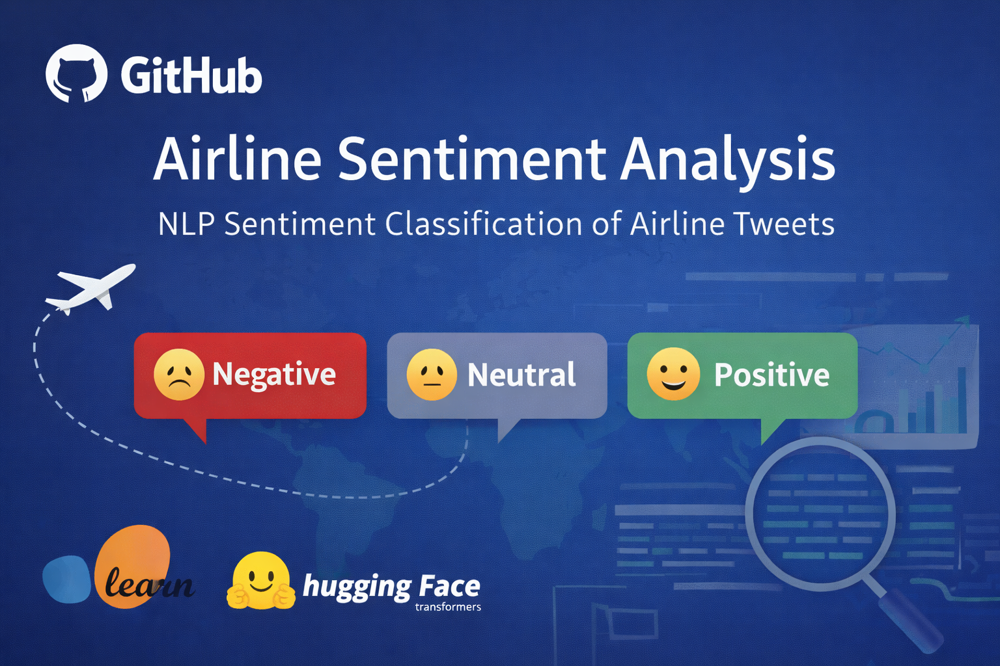
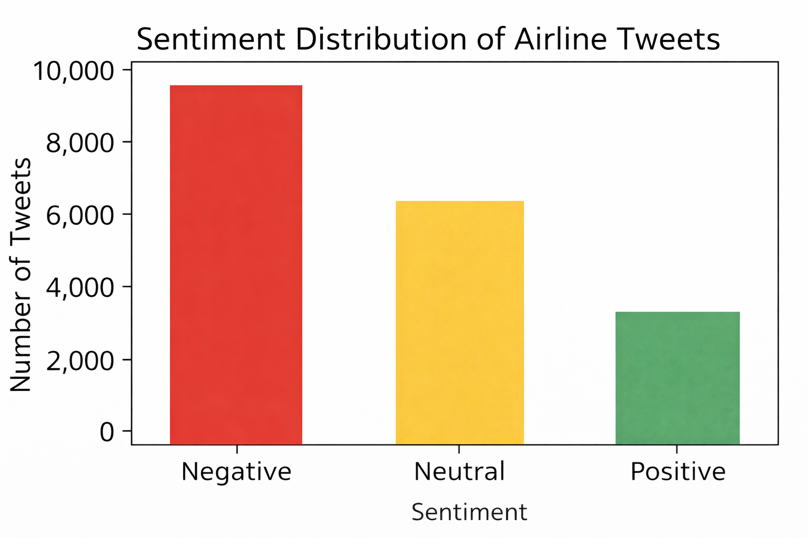
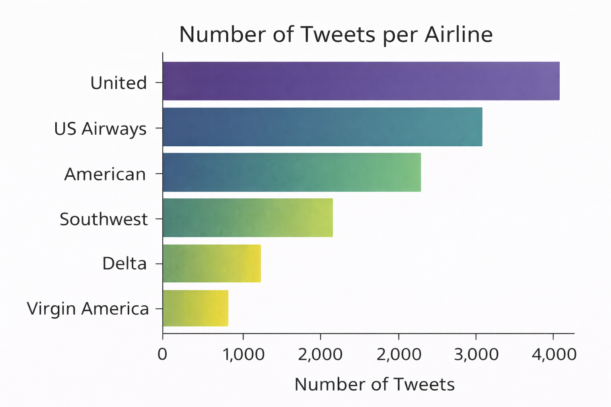
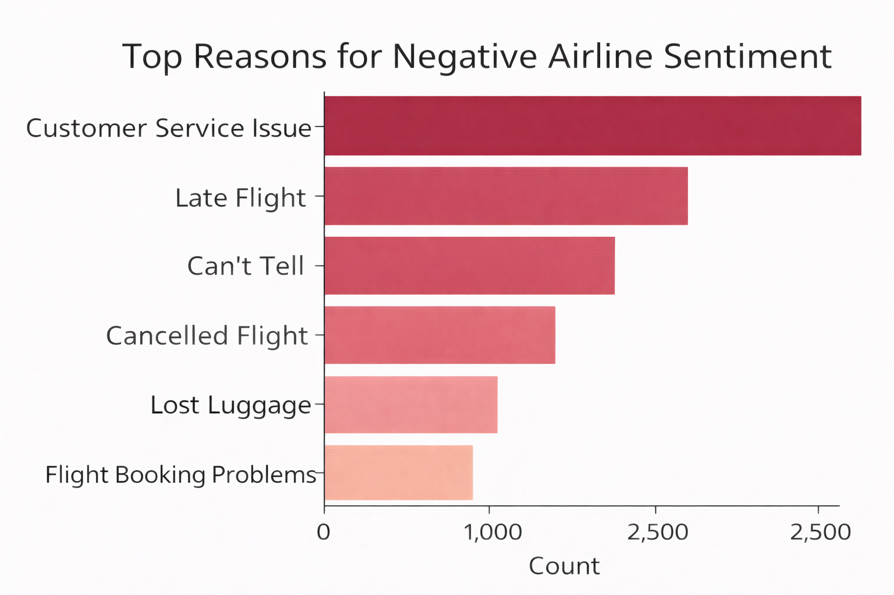
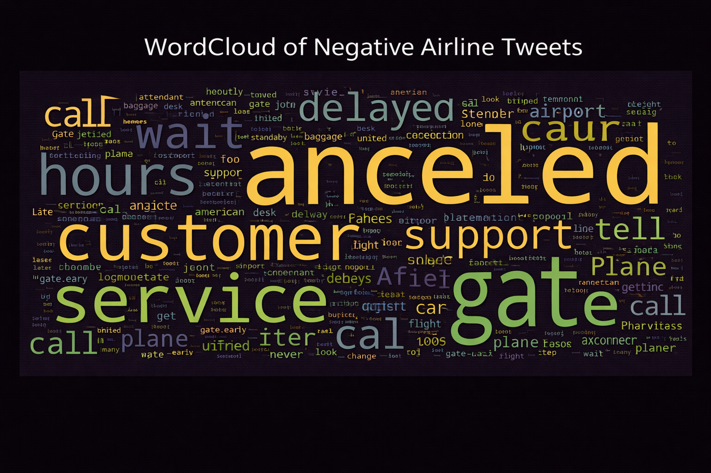
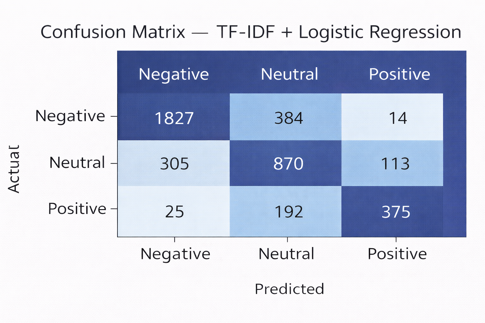

<p align="center">
  
</p>

## Project Preview

Below are key visual outputs generated in this project.

### 1) Sentiment Distribution
<p align="center">
  
</p>

### 2) Tweets per Airline
<p align="center">
  
</p>

### 3) Top Negative Reasons
<p align="center">
  
</p>

### 4) WordCloud (Negative Tweets)
<p align="center">
  
</p>

### 5) Confusion Matrix (TF-IDF + Logistic Regression)
<p align="center">
  
</p>

<p align="center">
  
</p>

# ✈️ Airline Sentiment Analysis using NLP


---

# Project Overview

This project applies **Natural Language Processing (NLP)** techniques to analyze customer sentiment in airline-related tweets.

The objective is to automatically classify tweets into **positive, neutral, or negative sentiment**, helping identify patterns in customer complaints and feedback.

The project demonstrates a **complete machine learning pipeline**, including:

• Data exploration
• Text preprocessing
• Feature engineering using TF-IDF
• Sentiment classification
• Model evaluation and visualization

Dataset used: **Twitter US Airline Sentiment (Kaggle)**

---

# Dataset

The dataset contains **14,640 tweets** directed at major US airlines.

### Key Columns

| Column            | Description                   |
| ----------------- | ----------------------------- |
| text              | Tweet content                 |
| airline_sentiment | Target sentiment label        |
| airline           | Airline mentioned             |
| negativereason    | Reason for negative sentiment |

### Airlines Included

* United
* American
* Delta
* Southwest
* US Airways
* Virgin America

---

# Project Workflow

The project follows a structured **NLP pipeline**:

1. Data Loading
2. Exploratory Data Analysis
3. Sentiment Distribution Analysis
4. Negative Reason Analysis
5. Text Cleaning and Preprocessing
6. Feature Engineering (TF-IDF)
7. Logistic Regression Model Training
8. Model Evaluation
9. Visualization of Results

---

# Key Visualizations

## Sentiment Distribution

<p align="center">
  
</p>

The dataset shows a strong presence of **negative airline feedback**, reflecting common customer frustrations.

---

## Tweets per Airline

<p align="center">
  
</p>

This chart shows the distribution of tweets across different airlines.

---

## Top Reasons for Negative Sentiment

<p align="center">
  
</p>

Frequent complaint categories include:

• Flight delays
• Flight cancellations
• Poor customer service
• Late notifications

---

## Word Cloud of Negative Tweets

<p align="center">
  
</p>

The word cloud highlights the most frequent terms used in negative airline tweets.

---

## Confusion Matrix

<p align="center">
  
</p>

The confusion matrix visualizes how accurately the model classifies tweet sentiment.

---

# Model

The baseline sentiment classifier uses:

**TF-IDF + Logistic Regression**

TF-IDF converts tweet text into numerical features that the model can learn from.

---

# Model Performance

| Model                    | Features    | Accuracy | Notes                 |
| ------------------------ | ----------- | -------- | --------------------- |
| Logistic Regression      | TF-IDF      | ~79%     | Baseline ML model     |
| DistilBERT (Future Work) | Transformer | TBD      | Deep learning upgrade |

---

# Technologies Used

Python
Pandas
NumPy
Matplotlib
Seaborn
Scikit-learn
WordCloud
Jupyter Notebook

---

# Project Structure

```
airline-sentiment-nlp
│
├── data
│   └── Tweets.csv
│
├── notebook
│   └── Airline_Sentiment_NLP.ipynb
│
├── outputs
│   ├── figures
│   ├── metrics
│   ├── models
│   └── logs
│
├── images
│   └── banner1.png
│
├── README.md
└── .gitignore
```

---

# Future Improvements

Potential improvements include:

• Hyperparameter tuning
• Transformer models (BERT / DistilBERT)
• Real-time sentiment monitoring dashboard
• Deployment using Streamlit

---

# Author

**Noor Saba**

Aspiring Data Scientist | AI & Machine Learning Enthusiast

GitHub:
https://github.com/noorsaba5

---

# Summary

This project demonstrates how **Natural Language Processing techniques can transform raw customer feedback into actionable insights**, helping organizations better understand customer sentiment and improve service quality.
